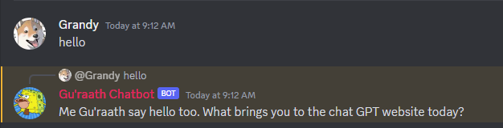

<h1 align="center">apk-portfolio</h1>

<h3 align="center">Andrew Kohn</h3>

<div align='center'>
  
</div>

<div align="center">
  <a href="https://discord.gg/c27D5CXkA5" target="_blank">Discord test server invite link</a>
</div>

#

### Introduction

A discord chatbot utilizing openAI's chatGPT. As of right now, the chatbot will store 20 past messages to it's conversation log from each individual user in the chat.

The bot will act under the name Gu'raath, a caveman that works at a call center in the USA.

#

<h2 align="center">Technology Used</h2>

<div align="center">
 
   
  &nbsp;
   
  &nbsp;
  
          
</div>

#

## Installation & running chatbot

A .env.example is provided and can be used as a template.

1. Create a .env file in the base directory.

2. Follow the discord dev portal and create a new application & bot.

- Insert bot token to your .env file.

3. Install and/or open discord and create a server.

- Create a text room or use the general chat and copy the channel id.
- Insert channel id to the .env file.

4. Sign-up/Login to openAI and insert your openAI API key to the .env file.

```
npm install
node index.js
```

#
